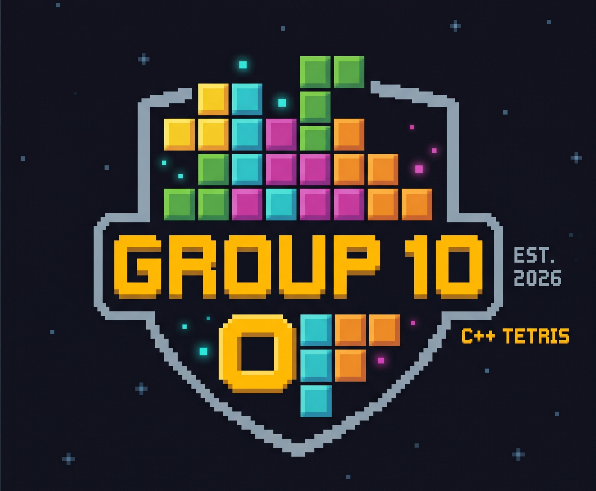
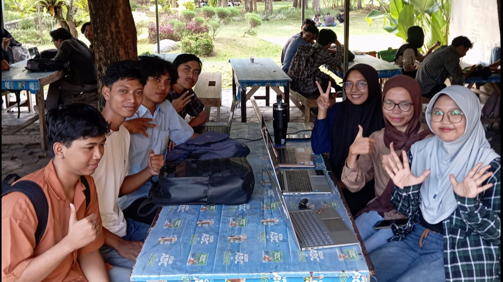

<p align="center">
  
</p>

BlockMaster adalah permainan Tetris klasik berbasis konsol (*terminal-based game*) yang dibangun menggunakan bahasa pemrograman C++. Game ini memanfaatkan ANSI *escape codes* untuk menghasilkan visual yang berwarna dan animasi yang interaktif langsung di dalam terminal Windows. Selain itu, game ini dilengkapi dengan musik tema legendaris Tetris dan efek suara yang dibuat secara programatis menggunakan modul audio Windows API.

---

## 🚀 Fitur Utama

* **Gameplay Tetris Klasik:** Mekanisme penuh mulai dari pergerakan blok, rotasi, kalkulasi baris penuh (*line clearing*), hingga peningkatan level secara berkala seiring bertambahnya skor.
* **Fitur Hold Block:** Simpan blok yang sedang aktif menggunakan tombol khusus (`C`) untuk digunakan di strategi berikutnya.
* **Sistem High Score:** Skor tertinggi Anda akan otomatis disimpan ke dalam berkas teks (`highscore.txt`) dan diurutkan secara waktu nyata (*real-time*).
* **Menu Panduan Interaktif (How to Play):** Animasi tutorial langsung di dalam konsol yang memandu pemain cara menggerakkan, memutar, menjatuhkan, dan menyimpan blok.
* **Tampilan Berwarna (ANSI Color):** Antarmuka terminal yang memukau menggunakan visualisasi blok berwarna-warni yang estetik.

---

## 🕹️ Cara Pakai & Kontrol Game

### Navigasi Menu Utama
* **Panah Atas ($\uparrow$) / Panah Bawah ($\downarrow$):** Memilih opsi menu.
* **Enter:** Mengonfirmasi pilihan.

### Kontrol Saat Bermain (Gameplay)
| Tombol | Aksi |
| :--- | :--- |
| **Panah Kiri ($\leftarrow$)** | Menggeser blok ke kiri |
| **Panah Kanan ($\rightarrow$)** | Menggeser blok ke kanan |
| **Panah Atas ($\uparrow$)** | Memutar blok (*Rotate*) |
| **Panah Bawah ($\downarrow$)** | Turun cepat perlahan (*Soft Drop*) |
| **Spacebar** | Jatuh instan ke dasar (*Hard Drop*) |
| **C** / **c** | Menyimpan blok ke kotak HOLD |
| **ESC** | Keluar dari permainan ke Menu Utama |

### Navigasi Halaman Tutorial (How to Play)
* **N / n:** Halaman Selanjutnya (*Next Page*)
* **B / b:** Halaman Sebelumnya (*Back Page*)
* **K / k:** Keluar ke Menu Utama (*Exit*)

---

## 🛠️ Cara Menjalankan Project

### Prasyarat (Prerequisites)
1.  **Sistem Operasi:** Khusus Windows (karena menggunakan *library* `<conio.h>` dan komponen Windows API `PlaySoundA`).
2.  **Kompiler:** MinGW / GCC atau IDE seperti Dev-C++ / Code::Blocks / Visual Studio.

### Langkah Kompilasi via Terminal (CLI)
Buka Command Prompt atau PowerShell di direktori tempat file Anda berada, lalu jalankan perintah:

```bash
g++ BlockMaster.cpp -o TetrisGame.exe && .\TetrisGame.exe
```
## 📂 Struktur Berkas
Setelah program dikompilasi dan dijalankan untuk pertama kalinya, sistem akan otomatis menghasilkan beberapa berkas pendukung. Berikut adalah struktur direktori proyek yang terbentuk:
```
├── 📄 BlockMaster.cpp      # Source code utama permainan Tetris
├── ⚙️ BlockMaster.exe      # Executable file hasil kompilasi
├── 📝 highscore.txt        # Berkas penyimpanan data 7 skor tertinggi (Otomatis dibuat)
```
## 👥 Kontributor (Credits)
Proyek ini dikembangkan bersama oleh:
| NAME | STUDENT ID | ROLE |
| :--- | :--- | :--- |
| **Maulana Isna Andika** | F1D02510072 | Advance Fitur and logic developer |
| **Aura Iftita Ihzarani** | F1D02510107 | Game Core Engineer |
| **HABIB** |  | Block and Next Designer|
| **Muhammad Bintang Arifin** | F1D02510124 | UI Designer|
| **Nayudha Ezra Wicaksana** | F1D02510019 | Block logic |
| **Nisa Agnia** | F1D02510087 | HOLD fitur and board engineer |
| **Sarah Amelia Agustina Putri** | F1D02510133 | Board Logic |

Special credit:
| ROLE | NAME | STUDENT ID |
| :--- | :--- | :--- |
| **Coordinator Praktikum** | I Nyoman Widiyasa Jayananda | F1D02410053 |
| **Pendamping** | Abdurrahman Karim | F1D02410031 |

---
<table align="center">
  <tr>
    <td></td>
    <td></td>
    <td></td>
  </tr>
</table>
